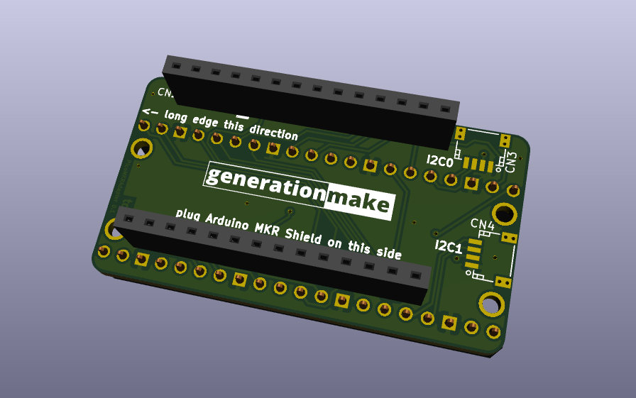

# PicoMKRAdapter
adapter board to connect a Raspberry Pi Pico to an Arduino MKR Shield and vice versa

### Raspberry Pi Pico Side

### Arduino MKR Side

## PCB

### Top

### Bottom

## License

This hardware is licensed under the CERN OHL v. 1.2
