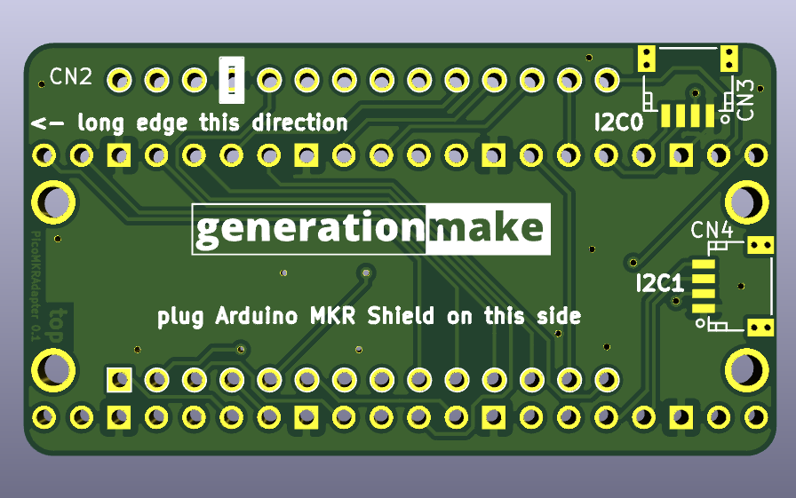

# PicoMKRAdapter
adapter board to connect a Raspberry Pi Pico to an Arduino MKR Shield and vice versa

### Raspberry Pi Pico Side

### Arduino MKR Side

## pin usage

### Arduino MKR connector CN2 vs Raspberry Pi Pico connector CN1

| **Pin** | **Pin Name** | **Pin Name**      | **Pin**                                |
|:-------:|:------------:|:-----------------:|:--------------------------------------:|
| x  | **Arduino MKR**   | **Raspberry Pi Pico**                                 |  x |
| 1       | AREF         | ADC_VREF          | 35                                     |
| 2       | DAC0/A0      | GP26/ADC0         | 31                                     |
| 3       | A1           | GP27/ADC1         | 32                                     |
| 4       | A2           | GP28/ADC2         | 34                                     |
| 5       | A3           | GP15              | 20                                     |
| 6       | A4           | GP22              | 29                                     |
| 7       | A5           | GP21              | 27                                     |
| 8       | A6           | GP20              | 26                                     |
| 9       | 0            | GP0               | 1                                      |
| 10      | 1            | GP1               | 2                                      |
| 11      | 2            | GP2               | 4                                      |
| 12      | 3            | GP3               | 5                                      |
| 13      | 4            | GP10              | 14                                     |
| 14      | 5            | GP5               | 7                                      |
| 15      | 6            | GP14              | 19                                     |
| 16      | 7            | GP11              | 15                                     |
| 17      | 8/MOSI       | GP7               | 10                                     |
| 18      | 9/SCK        | GP6               | 9                                      |
| 19      | 10/MISO      | GP4               | 6                                      |
| 20      | 11/SDA       | GP12/I2C0_SDA     | 16                                     |
| 21      | 12/SCL       | GP13/I2C0_SCL     | 17                                     |
| 22      | 13/RX        | GP9/UART1_RX      | 12                                     |
| 23      | 14/TX        | GP8/UART1_TX      | 11                                     |
| 24      | RESET        | RUN               | 30                                     |
| 25      | GND          | GND               | 3..38                                  |
| 26      | VCC          | 3V3               | 36                                     |
| 27      | VIN          | VBUS              | 40                                     |
| 28      | 5V0          | VSYS              | 39                                     |

## PCB

### Top

### Bottom

## License

This hardware is licensed under the CERN OHL v. 1.2
